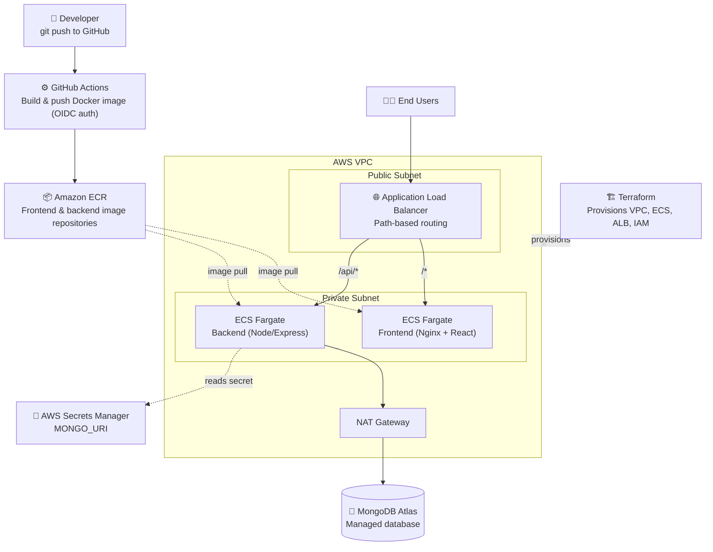

# TaskFlow — MERN Deployment on AWS ECS with Terraform & GitHub Actions CI/CD

A production-pattern deployment of a full MERN (MongoDB, Express, React, Node.js) application to AWS, built entirely with Infrastructure as Code and a fully automated CI/CD pipeline.

> **Live demo:** `http://mern-devops-alb-1172630931.us-east-1.elb.amazonaws.com`
> *(Demo environment — infrastructure may be scaled down / destroyed periodically to manage AWS costs)*

---

## 📐 Architecture



**Request flow:** User hits the ALB → routed by path (`/api/*` → backend, everything else → frontend) → both services run as ECS Fargate tasks in private subnets → backend reads its MongoDB connection string from AWS Secrets Manager at runtime → outbound traffic to MongoDB Atlas goes through a NAT Gateway.

---

## 🛠️ Tech Stack

| Layer | Technology |
|---|---|
| Frontend | React, served via Nginx |
| Backend | Node.js, Express |
| Database | MongoDB Atlas (managed, external to AWS) |
| Containerization | Docker (multi-stage builds) |
| Container Registry | Amazon ECR (immutable tags, vulnerability scan on push) |
| Orchestration | Amazon ECS on Fargate (serverless containers) |
| Networking | Custom VPC, public/private subnets, NAT Gateway, Application Load Balancer |
| Infrastructure as Code | Terraform (modular: vpc, security, alb, ecs-cluster, ecs-service, ecr) |
| CI/CD | GitHub Actions, authenticated to AWS via OIDC (no long-lived keys) |
| Secrets Management | AWS Secrets Manager |
| Observability | Amazon CloudWatch (Container Insights, logs, metrics) |

---

## ✨ Key Engineering Decisions

- **Stateless database strategy** — MongoDB runs on Atlas, not inside ECS, since Fargate containers are ephemeral and unsuitable for stateful workloads.
- **Path-based routing over CORS workarounds** — frontend and backend share one ALB/domain (`/api/*` vs `/*`), eliminating cross-origin issues by design instead of patching them with CORS headers.
- **OIDC-based CI/CD authentication** — GitHub Actions assumes a scoped IAM role via OpenID Connect instead of storing static AWS access keys as repo secrets.
- **Immutable image tags** — every deployment is tagged with the Git commit SHA, giving full traceability and instant rollback capability.
- **Private subnet isolation** — application containers have no public IPs; only the ALB is internet-facing, with security groups restricting traffic to ALB-origin only.
- **Modular Terraform** — infrastructure is written as reusable modules (`vpc`, `alb`, `ecs-service`, etc.) so the same code can stand up dev/staging/prod environments with different `.tfvars`.

---

## 🔄 CI/CD Pipeline

On every push to `main`:
1. GitHub Actions authenticates to AWS via OIDC (short-lived token, no stored secrets)
2. Docker image is built and tagged with the Git commit SHA
3. Image is pushed to the corresponding ECR repository
4. The existing ECS task definition is fetched and updated with the new image
5. ECS service is redeployed, and the workflow waits for the new tasks to become healthy before reporting success

---

## 📁 Repository Structure

This project spans three repositories:
- `frontend-repo` — React application + Dockerfile + GitHub Actions workflow
- `backend-repo` — Express API + Dockerfile + GitHub Actions workflow
- `infra-repo` — Terraform modules and environment configuration

```
infra-repo/
├── modules/
│   ├── vpc/
│   ├── security/
│   ├── alb/
│   ├── ecs-cluster/
│   ├── ecs-service/
│   ├── ecr/
│   └── github-oidc/
└── environments/
    └── dev/
        ├── main.tf
        ├── variables.tf
        ├── outputs.tf
        └── backend.tf
```

---

## 🚀 Deploying This Yourself

```bash
# 1. Set up Terraform remote state (one-time)
aws s3api create-bucket --bucket <your-tfstate-bucket> --region us-east-1
aws dynamodb create-table --table-name terraform-locks \
  --attribute-definitions AttributeName=LockID,AttributeType=S \
  --key-schema AttributeName=LockID,KeyType=HASH \
  --billing-mode PAY_PER_REQUEST

# 2. Provision infrastructure
cd infra-repo/environments/dev
terraform init
terraform apply

# 3. Set your MongoDB Atlas connection string
aws secretsmanager put-secret-value \
  --secret-id <project>/mongo-uri \
  --secret-string "<your-mongodb-atlas-uri>"

# 4. Push to main in frontend-repo / backend-repo — GitHub Actions handles the rest
```

---

## 🔮 Future Improvements

- [ ] HTTPS via ACM certificate + HTTP→HTTPS redirect on the ALB
- [ ] Auto Scaling policies based on CPU/memory utilization
- [ ] CloudWatch Alarms + SNS notifications for unhealthy tasks
- [ ] Multi-environment support (staging/prod) using the existing Terraform modules
- [ ] WAF in front of the ALB

---

## 👤 Author

**Muhammad Zaid** — Transitioning from Mechanical Engineering into DevOps & Cloud Engineering.
[LinkedIn](#) · [GitHub](#)